# Music Player System - Class Diagram

```mermaid
classDiagram
    direction TB

    %% Core Models
    class Song {
        -string title
        -string artist
        -string filePath
        +Song(title, artist, path)
        +getTitle() string
        +getArtist() string
        +getFilePath() string
    }

    class Playlist {
        -string playlistName
        -vector~Song*~ songList
        +Playlist(playlistName)
        +getPlaylistName() string
        +getSongs() vector~Song*~
        +getSize() int
        +addSongToPlaylist(Song*)
    }

    %% Strategy Pattern - Play Strategies
    class PlayStrategy {
        <<interface>>
        +setPlaylist(Playlist*)
        +next() Song*
        +hasNext() bool
        +previous() Song*
        +hasPrevious() bool
        +addToNext(Song*)
    }

    class SequentialPlayStrategy {
        -Playlist* currentPlaylist
        -int currentIndex
        +setPlaylist(Playlist*)
        +next() Song*
        +hasNext() bool
        +previous() Song*
        +hasPrevious() bool
    }

    class RandomPlayStrategy {
        -Playlist* currentPlaylist
        -vector~int~ playedIndices
        +setPlaylist(Playlist*)
        +next() Song*
        +hasNext() bool
        +previous() Song*
        +hasPrevious() bool
    }

    class CustomQueueStrategy {
        -Playlist* currentPlaylist
        -queue~Song*~ customQueue
        -int currentIndex
        +setPlaylist(Playlist*)
        +next() Song*
        +hasNext() bool
        +previous() Song*
        +hasPrevious() bool
        +addToNext(Song*)
    }

    %% Adapter Pattern - Audio Output Devices
    class IAudioOutputDevice {
        <<interface>>
        +playAudio(Song*)
    }

    class BluetoothSpeakerAdapter {
        -BlutetoothSpeakerAPI* bluetoothApi
        +BluetoothSpeakerAdapter(BlutetoothSpeakerAPI*)
        +playAudio(Song*)
    }

    class HeadphonesAdapter {
        -HeadphonesAPI* headphonesApi
        +HeadphonesAdapter(HeadphonesAPI*)
        +playAudio(Song*)
    }

    class WiredSpeakerAdapter {
        -WiredSpeakerAPI* wiredApi
        +WiredSpeakerAdapter(WiredSpeakerAPI*)
        +playAudio(Song*)
    }

    %% External APIs
    class BlutetoothSpeakerAPI {
        +playSoundViaBlutetooth(string)
    }

    class HeadphonesAPI {
        +playSoundViaHeadphones(string)
    }

    class WiredSpeakerAPI {
        +playSoundViaWiredSpeaker(string)
    }

    %% Factory Pattern
    class DeviceFactory {
        <<static>>
        +createDevice(DeviceType) IAudioOutputDevice*
    }

    %% Enums
    class DeviceType {
        <<enumeration>>
        BLUETOOTH
        WIRED
        HEADPHONES
    }

    class PlayStrategyType {
        <<enumeration>>
        SEQUENTIAL
        RANDOM
        CUSTOM
    }

    %% Managers (Singletons)
    class DeviceManager {
        <<Singleton>>
        -static DeviceManager* instance
        -IAudioOutputDevice* currentOutputDevice
        +getInstance() DeviceManager*
        +connect(DeviceType)
        +getOutputDevice() IAudioOutputDevice*
        +hasOutputDevice() bool
    }

    class PlaylistManager {
        <<Singleton>>
        -static PlaylistManager* instance
        -map~string,Playlist*~ playlists
        +getInstance() PlaylistManager*
        +addPlaylist(Playlist*)
        +getPlaylist(string) Playlist*
    }

    class StrategyManager {
        <<Singleton>>
        -static StrategyManager* instance
        -SequentialPlayStrategy* sequentialStrategy
        -RandomPlayStrategy* randomStrategy
        -CustomQueueStrategy* customQueueStrategy
        +getInstance() StrategyManager*
        +getStrategy(PlayStrategyType) PlayStrategy*
    }

    %% Core Engine
    class AudioEngine {
        -Song* currentSong
        -bool songIsPaused
        +getCurrentSongTitle() string
        +isPaused() bool
        +play(IAudioOutputDevice*, Song*)
        +pause()
    }

    %% Facade Pattern
    class MusicPlayerFacade {
        <<Singleton>>
        -static MusicPlayerFacade* instance
        -AudioEngine* audioEngine
        -Playlist* loadedPlaylist
        -PlayStrategy* playStrategy
        +getInstance() MusicPlayerFacade*
        +connectDevice(DeviceType)
        +setPlayStrategy(PlayStrategyType)
        +loadPlaylist(string)
        +playSong(Song*)
        +pauseSong(Song*)
        +playAllTracks()
        +playNextTrack()
        +playPreviousTrack()
        +enqueueNext(Song*)
    }

    class MusicPlayerApplication {
        +main()
    }

    %% Relationships - Core Models
    Playlist o-- Song : contains

    %% Relationships - Strategy Pattern
    PlayStrategy <|.. SequentialPlayStrategy
    PlayStrategy <|.. RandomPlayStrategy
    PlayStrategy <|.. CustomQueueStrategy
    PlayStrategy --> Playlist : uses
    PlayStrategy --> Song : returns

    %% Relationships - Adapter Pattern
    IAudioOutputDevice <|.. BluetoothSpeakerAdapter
    IAudioOutputDevice <|.. HeadphonesAdapter
    IAudioOutputDevice <|.. WiredSpeakerAdapter

    BluetoothSpeakerAdapter --> BlutetoothSpeakerAPI : adapts
    HeadphonesAdapter --> HeadphonesAPI : adapts
    WiredSpeakerAdapter --> WiredSpeakerAPI : adapts

    %% Relationships - Factory Pattern
    DeviceFactory ..> DeviceType : uses
    DeviceFactory ..> IAudioOutputDevice : creates
    DeviceFactory ..> BluetoothSpeakerAdapter : instantiates
    DeviceFactory ..> HeadphonesAdapter : instantiates
    DeviceFactory ..> WiredSpeakerAdapter : instantiates

    %% Relationships - Managers
    DeviceManager --> DeviceFactory : uses
    DeviceManager --> IAudioOutputDevice : manages
    DeviceManager ..> DeviceType : uses

    PlaylistManager o-- Playlist : stores

    StrategyManager o-- SequentialPlayStrategy : owns
    StrategyManager o-- RandomPlayStrategy : owns
    StrategyManager o-- CustomQueueStrategy : owns
    StrategyManager ..> PlayStrategyType : uses

    %% Relationships - Audio Engine
    AudioEngine --> IAudioOutputDevice : uses
    AudioEngine --> Song : plays

    %% Relationships - Facade
    MusicPlayerFacade *-- AudioEngine : owns
    MusicPlayerFacade --> Playlist : loads
    MusicPlayerFacade --> PlayStrategy : uses
    MusicPlayerFacade --> DeviceManager : delegates to
    MusicPlayerFacade --> PlaylistManager : delegates to
    MusicPlayerFacade --> StrategyManager : delegates to
    MusicPlayerFacade ..> DeviceType : uses
    MusicPlayerFacade ..> PlayStrategyType : uses

    %% Application Entry Point
    MusicPlayerApplication --> MusicPlayerFacade : uses
```



## Design Patterns Used

| Pattern       | Where                                                                                                                                               |
| ------------- | --------------------------------------------------------------------------------------------------------------------------------------------------- |
| **Facade**    | `MusicPlayerFacade` — Provides a simplified interface to the complex subsystems (DeviceManager, PlaylistManager, StrategyManager, AudioEngine)      |
| **Singleton** | `MusicPlayerFacade`, `DeviceManager`, `PlaylistManager`, `StrategyManager` — Single global instances for centralized control                        |
| **Adapter**   | `BluetoothSpeakerAdapter`, `HeadphonesAdapter`, `WiredSpeakerAdapter` — Adapt external speaker APIs to the `IAudioOutputDevice` interface           |
| **Strategy**  | `SequentialPlayStrategy`, `RandomPlayStrategy`, `CustomQueueStrategy` — Different algorithms for playing songs from a playlist, selected at runtime |
| **Factory**   | `DeviceFactory` — Creates appropriate device adapter instances based on `DeviceType` without exposing instantiation logic                           |

## Flow

```
main (MusicPlayerApplication)
 └─ MusicPlayerFacade::getInstance()                    ← Facade + Singleton
     ├─ AudioEngine                                     ← Core audio playback engine
     ├─ DeviceManager::getInstance()                    ← Singleton
     │   └─ DeviceFactory::createDevice()               ← Factory pattern
     │       ├─ BluetoothSpeakerAdapter                 ← Adapter pattern
     │       ├─ HeadphonesAdapter                       ← Adapter pattern
     │       └─ WiredSpeakerAdapter                     ← Adapter pattern
     ├─ PlaylistManager::getInstance()                  ← Singleton
     │   └─ Playlist → Song                             ← Models
     └─ StrategyManager::getInstance()                  ← Singleton
         ├─ SequentialPlayStrategy                      ← Strategy pattern
         ├─ RandomPlayStrategy                          ← Strategy pattern
         └─ CustomQueueStrategy                         ← Strategy pattern

Operation Flow:
1. connectDevice(deviceType)
   └─ DeviceManager → DeviceFactory → creates adapter for external API

2. setPlayStrategy(strategyType)
   └─ StrategyManager → returns requested strategy instance

3. loadPlaylist(name)
   └─ PlaylistManager → returns playlist → sets on playStrategy

4. playNextTrack() / playAllTracks()
   └─ PlayStrategy.next() → Song
       └─ AudioEngine.play(device, song)
           └─ IAudioOutputDevice.playAudio(song)
               └─ External API (Bluetooth/Headphones/Wired)
```

## Key Components

### MusicPlayerFacade

The main entry point that hides the complexity of:

- Device management and connection
- Playlist loading and management
- Play strategy selection
- Audio playback control

### Managers

- **DeviceManager**: Manages audio output device connections
- **PlaylistManager**: Stores and retrieves playlists
- **StrategyManager**: Provides pre-instantiated play strategies

### Adapters

Convert external speaker/headphone APIs into a unified `IAudioOutputDevice` interface:

- **BluetoothSpeakerAdapter** → `BlutetoothSpeakerAPI`
- **HeadphonesAdapter** → `HeadphonesAPI`
- **WiredSpeakerAdapter** → `WiredSpeakerAPI`

### Strategies

Different song playback orders:

- **SequentialPlayStrategy**: Plays songs in order
- **RandomPlayStrategy**: Shuffles and plays songs randomly
- **CustomQueueStrategy**: Allows custom queue management with `addToNext()`

## Usage Example

```cpp
// Get facade instance
MusicPlayerFacade* player = MusicPlayerFacade::getInstance();

// Connect bluetooth speaker
player->connectDevice(DeviceType::BLUETOOTH);

// Set sequential playback
player->setPlayStrategy(PlayStrategyType::SEQUENTIAL);

// Load a playlist
player->loadPlaylist("My Favorites");

// Play all tracks
player->playAllTracks();

// Or play one song at a time
player->playNextTrack();
player->playPreviousTrack();

// Add a song to play next (Custom queue strategy)
player->setPlayStrategy(PlayStrategyType::CUSTOM);
player->enqueueNext(someSong);
```
