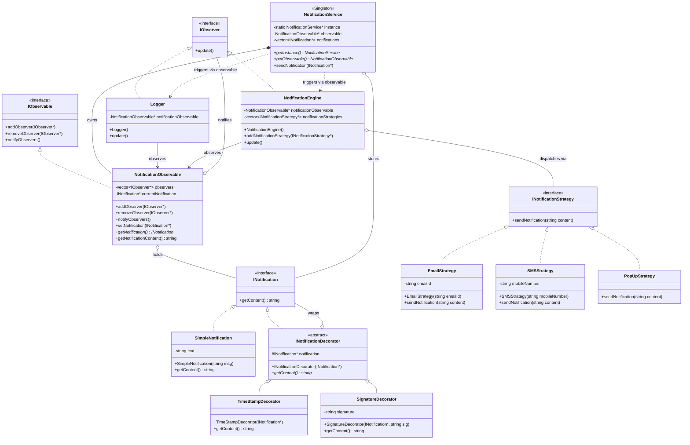

# Notification System - Class Diagram



## Design Patterns Used

| Pattern       | Where                                                                                                                                                         |
| ------------- | ------------------------------------------------------------------------------------------------------------------------------------------------------------- |
| **Singleton** | `NotificationService` — single global instance                                                                                                                |
| **Observer**  | `NotificationObservable` (subject) notifies `Logger` and `NotificationEngine` (observers) on every new notification                                           |
| **Decorator** | `TimeStampDecorator` and `SignatureDecorator` wrap an `INotification` to add content at runtime without changing the base class                               |
| **Strategy**  | `NotificationEngine` holds a list of `INotificationStrategy` implementations (`EmailStrategy`, `SMSStrategy`, `PopUpStrategy`) and delegates dispatch to them |

## Flow

```
main
 └─ NotificationService::getInstance()          ← Singleton
     └─ NotificationObservable                  ← Subject (Observer pattern)
         ├─ Logger                              ← Observer — logs to console
         └─ NotificationEngine                  ← Observer — dispatches via strategies
             ├─ EmailStrategy
             ├─ SMSStrategy
             └─ PopUpStrategy

sendNotification(notification)
 └─ INotification (built with Decorators)       ← Decorator pattern
     └─ SignatureDecorator
         └─ TimeStampDecorator
             └─ SimpleNotification
```
