# Low-Level Design Notes

## SOLID Design Principles

### 1. Single Responsibility Principle (SRP)

**Definition:** A class should have one, and only one, reason to change.
**Example:** A `User` class should handle user data, but not email notifications.

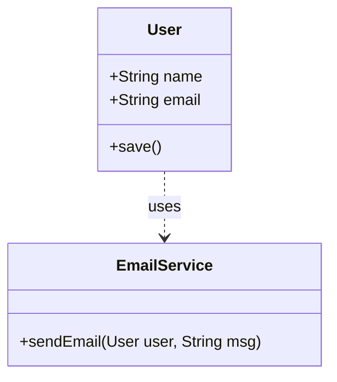

```java
// Violation: User handles db and email
class User {
    void save() { ... }
    void sendEmail() { ... }
}

// Fix:
class User {
    void save() { /* database logic */ }
}
class EmailService {
    void sendEmail(User u) { /* email logic */ }
}
```

### 2. Open/Closed Principle (OCP)

**Definition:** Software entities should be open for extension, but closed for modification.
**Example:** Calculating area for different shapes.

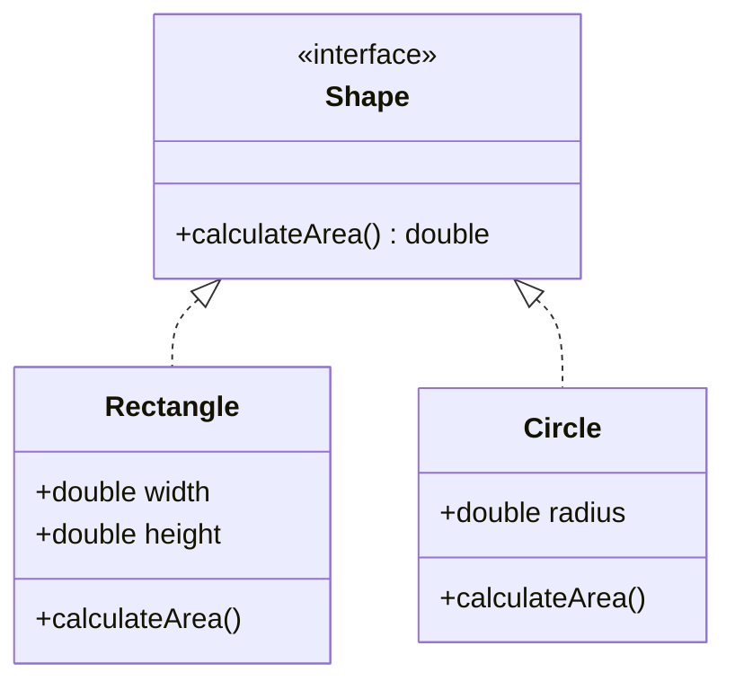

```java
interface Shape {
    double calculateArea();
}

class Rectangle implements Shape {
    public double calculateArea() { return width * height; }
}

class Circle implements Shape {
    public double calculateArea() { return Math.PI * radius * radius; }
}

// Adding a new shape (Triangle) doesn't modify existing code.
```

### 3. Liskov Substitution Principle (LSP)

**Definition:** Subtypes must be substitutable for their base types without altering the correctness of the program.
**Example:** The classic "Square is a Rectangle" problem.

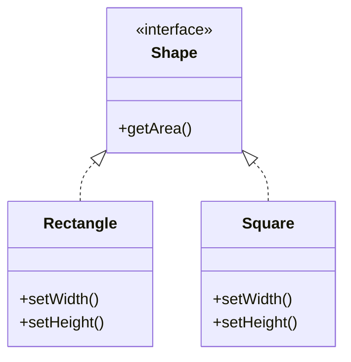

```java
// Violation:
class Rectangle {
    void setWidth(int w) { this.w = w; }
    void setHeight(int h) { this.h = h; }
}
class Square extends Rectangle {
    void setWidth(int w) { super.setWidth(w); super.setHeight(w); } // Breaks behavior
}

// Fix: Use a common interface without inheritance relationship between them if behaviors differ significantly
interface Shape { int getArea(); }
class Rectangle implements Shape { ... }
class Square implements Shape { ... }
```

### 4. Interface Segregation Principle (ISP)

**Definition:** Clients should not be forced to depend on methods they do not use.
**Example:** A Multi-Function Printer.

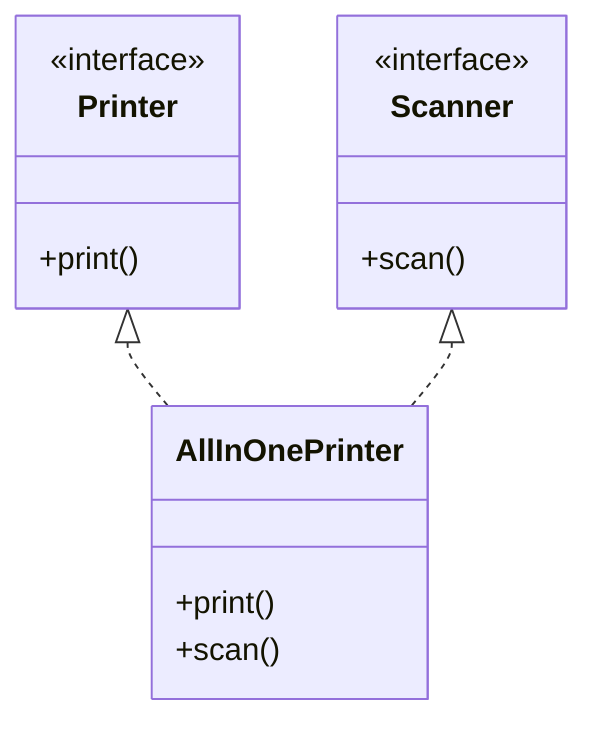

```java
// Violation: One big interface
interface Machine { void print(); void scan(); void fax(); }

// Fix: Segregate interfaces
interface Printer { void print(); }
interface Scanner { void scan(); }

class OldPrinter implements Printer {
    public void print() { /*...*/ }
}
```

### 5. Dependency Inversion Principle (DIP)

**Definition:** High-level modules should not depend on low-level modules. Both should depend on abstractions.
**Example:** A Switch controlling a Bulb.

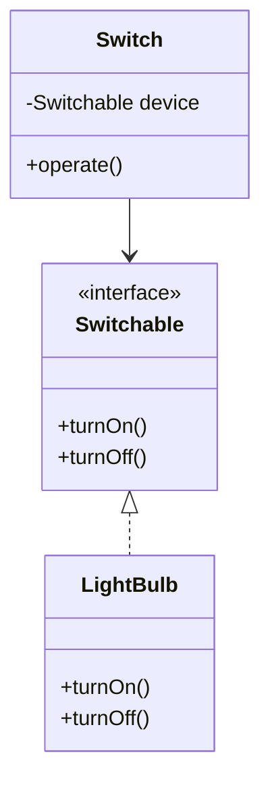

```java
interface Switchable {
    void turnOn();
    void turnOff();
}

class LightBulb implements Switchable {
    public void turnOn() { ... }
    public void turnOff() { ... }
}

class Switch {
    private Switchable device;
    public Switch(Switchable device) { this.device = device; }
    public void operate() { device.turnOn(); }
}
```

---

## Design Patterns

### 1. Singleton

**Definition:** Ensures a class has only one instance and provides a global point of access to it.
**Example:** Database Connection.

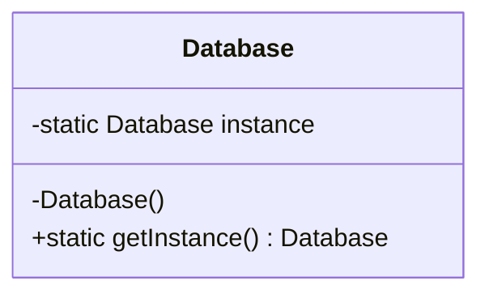

```java
class Database {
    private static Database instance;
    private Database() {} // Private constructor
    public static Database getInstance() {
        if (instance == null) instance = new Database();
        return instance;
    }
}
```

### 2. Factory Method

**Definition:** Defines an interface for creating an object, but let subclasses decide which class to instantiate.
**Example:** Logistics (Truck vs Ship).

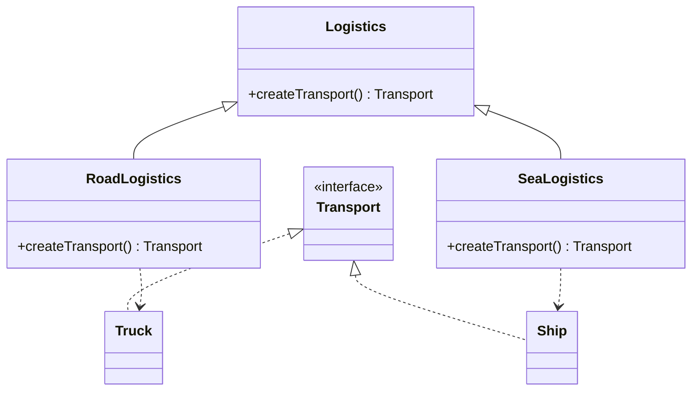

```java
abstract class Logistics {
    abstract Transport createTransport();
}

class RoadLogistics extends Logistics {
    Transport createTransport() { return new Truck(); }
}
```

### 3. Observer

**Definition:** Defines a one-to-many dependency between objects so that when one object changes state, all its dependents are notified and updated automatically.
**Example:** Newsletter / Youtube Channel.

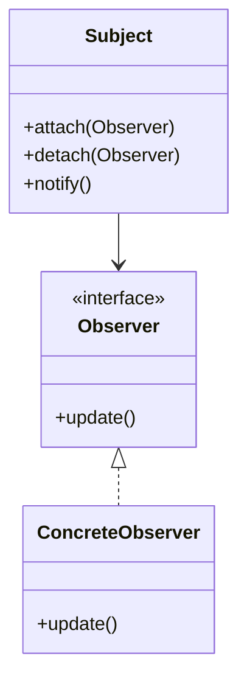

```java
class Subject {
    private List<Observer> observers = new ArrayList<>();
    public void attach(Observer o) { observers.add(o); }
    public void notifyUpdate() { for(Observer o : observers) o.update(); }
}

interface Observer { void update(); }
```

### 4. Decorator

**Definition:** Attaches additional responsibilities to an object dynamically.
**Example:** Coffee with add-ons (Milk, Sugar).

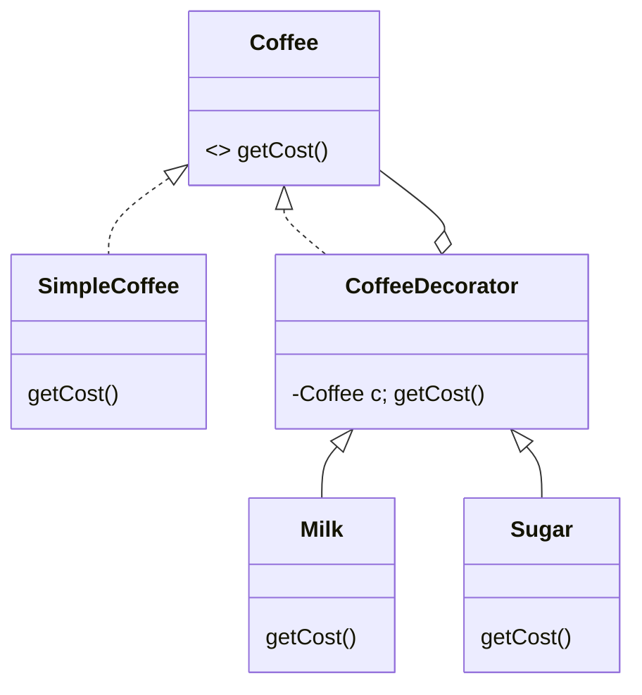

```java
interface Coffee { double getCost(); }
class SimpleCoffee implements Coffee { public double getCost() { return 5; } }

class CoffeeDecorator implements Coffee {
    protected Coffee decoratedCoffee;
    public CoffeeDecorator(Coffee c) { this.decoratedCoffee = c; }
    public double getCost() { return decoratedCoffee.getCost(); }
}

class Milk extends CoffeeDecorator {
    public Milk(Coffee c) { super(c); }
    public double getCost() { return super.getCost() + 2; }
}
```

### 5. Command

**Definition:** Encapsulates a request as an object, thereby letting you parameterize clients with different requests.
**Example:** Remote Control.

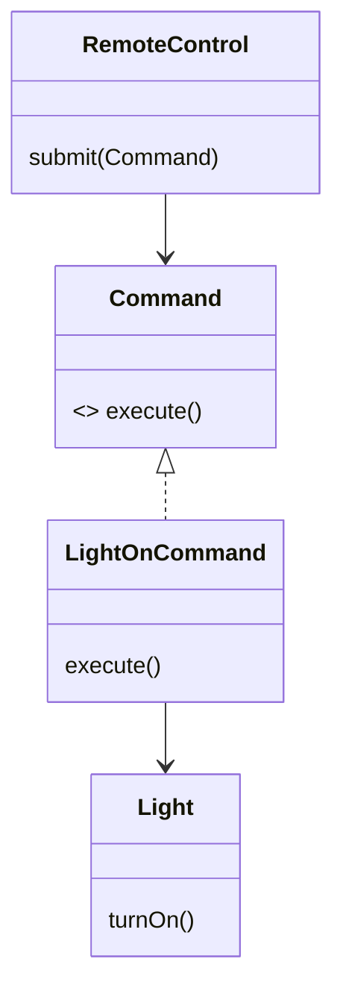

```java
interface Command { void execute(); }
class LightOnCommand implements Command {
    private Light light;
    public LightOnCommand(Light l) { this.light = l; }
    public void execute() { light.turnOn(); }
}
```

### 6. Adapter

**Definition:** Converts the interface of a class into another interface the clients expect.
**Example:** Lightning to USB adapter.

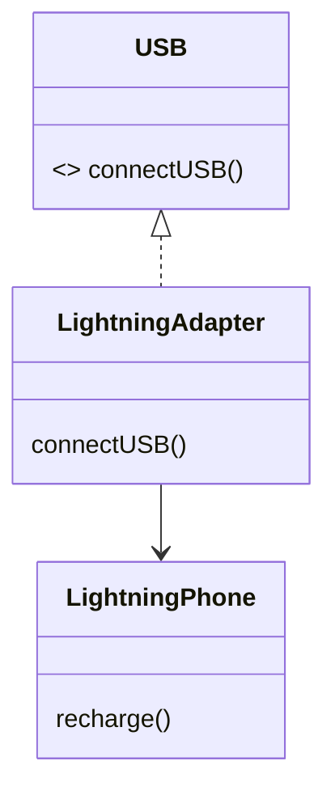

```java
interface USB { void connectUSB(); }
class LightningPhone { void recharge() { System.out.println("Charging Lightning"); } }

class LightningAdapter implements USB {
    private LightningPhone phone;
    public LightningAdapter(LightningPhone p) { this.phone = p; }
    public void connectUSB() { phone.recharge(); }
}
```

### 7. Facade

**Definition:** Provides a unified interface to a set of interfaces in a subsystem.
**Example:** Computer Startup.

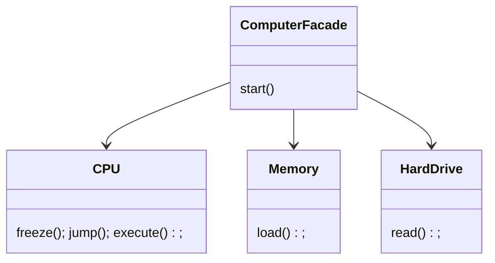

```java
class ComputerFacade {
    private CPU cpu;
    private Memory memory;
    private HardDrive hardDrive;

    public void start() {
        cpu.freeze();
        memory.load(BOOT_ADDRESS, hardDrive.read(BOOT_SECTOR, SECTOR_SIZE));
        cpu.jump(BOOT_ADDRESS);
        cpu.execute();
    }
}
```

---

## Other Concepts

### Principle of Least Knowledge (Law of Demeter)

**Definition:** A module should not know about the innards of the objects it manipulats. "Only talk to your immediate friends."
**Rule:** A method `M` of object `O` should only invoke methods of:

1. `O` itself.
2. Parameters passed to `M`.
3. Objects created within `M`.
4. Direct component objects of `O`.

**Bad:** `customer.getWallet().getBank().withdraw()`
**Good:** `customer.withdrawPayment()` (Delegation)

### Association

**Definition:** Association is a "has-a" or "uses-a" relationship between two classes where there is no ownership. They have their own lifecycle.

- **Aggregation:** "Has-a" with weak ownership (Classroom has Students; Students exist without Classroom).
- **Composition:** "Has-a" with strong ownership (House has Rooms; Rooms cannot exist without House).
