# Low-Level Design Notes

## OOP Fundamentals

### 1. Abstraction

**Definition:** Hiding implementation details and exposing only the essential interface to the outside world. Achieved via abstract classes and interfaces.
**Example:** A `Shape` abstract class hides _how_ area is computed — callers only know _that_ `getArea()` exists.

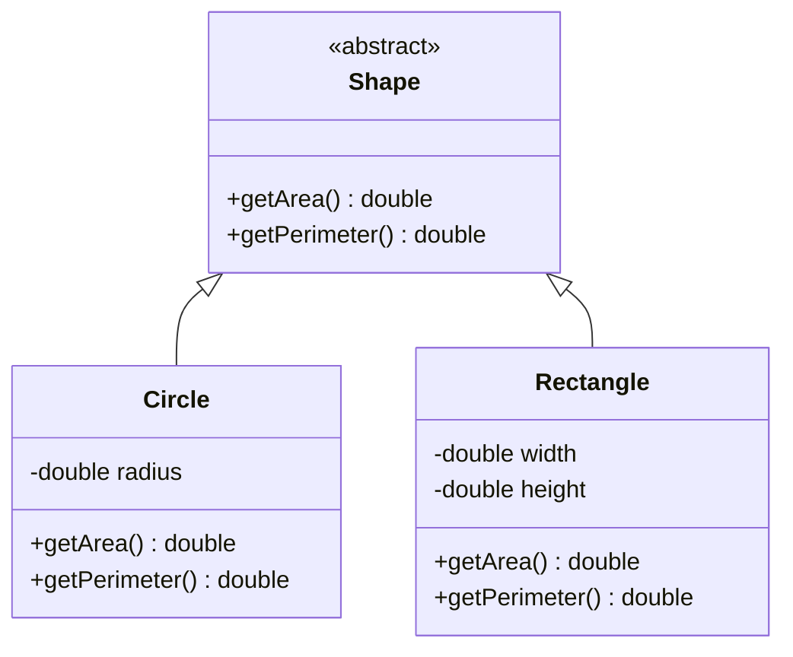
```mermaid
classDiagram
    class Shape {
        <<abstract>>
        +getArea() double
        +getPerimeter() double
    }
    class Circle {
        -double radius
        +getArea() double
        +getPerimeter() double
    }
    class Rectangle {
        -double width
        -double height
        +getArea() double
        +getPerimeter() double
    }
    Shape <|-- Circle
    Shape <|-- Rectangle
```

```java
abstract class Shape {
    abstract double getArea();
    abstract double getPerimeter();
}

class Circle extends Shape {
    private double radius;
    Circle(double r) { this.radius = r; }
    public double getArea()      { return Math.PI * radius * radius; }
    public double getPerimeter() { return 2 * Math.PI * radius; }
}
```

### 2. Encapsulation

**Definition:** Bundling data and the methods that operate on it into a single unit, and restricting direct access to internal state via access modifiers.
**Example:** A `BankAccount` keeps `balance` private and only allows changes through validated methods.

```java
class BankAccount {
    private double balance; // hidden from outside

    public void deposit(double amount) {
        if (amount > 0) balance += amount;
    }

    public boolean withdraw(double amount) {
        if (amount > 0 && balance >= amount) {
            balance -= amount;
            return true;
        }
        return false;
    }

    public double getBalance() { return balance; }
}
```

### 3. Inheritance

**Definition:** A child class acquires properties and behaviours of a parent class, enabling code reuse and "is-a" relationships.
**Example:** `Dog` and `Cat` both extend `Animal`, inheriting `eat()` and overriding `makeSound()`.

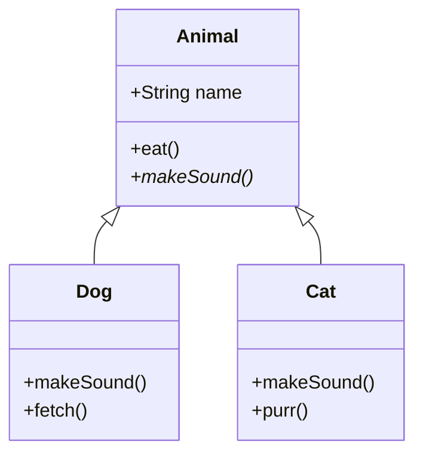
```mermaid
classDiagram
    class Animal {
        +String name
        +eat()
        +makeSound()*
    }
    class Dog {
        +makeSound()
        +fetch()
    }
    class Cat {
        +makeSound()
        +purr()
    }
    Animal <|-- Dog
    Animal <|-- Cat
```

```java
abstract class Animal {
    String name;
    void eat() { System.out.println(name + " is eating"); }
    abstract void makeSound();
}

class Dog extends Animal {
    void makeSound() { System.out.println("Woof!"); }
    void fetch()     { System.out.println("Fetching..."); }
}

class Cat extends Animal {
    void makeSound() { System.out.println("Meow!"); }
}
```

### 4. Polymorphism

**Definition:** The ability of an object to take on many forms. **Static (compile-time)** via method overloading; **Dynamic (runtime)** via method overriding.
**Example:** A `Calculator` overloads `add()`, while an `Animal` reference calls the correct `makeSound()` at runtime.

```java
// Static Polymorphism — Method Overloading (resolved at compile time)
class Calculator {
    int    add(int a, int b)          { return a + b; }
    double add(double a, double b)    { return a + b; }
    int    add(int a, int b, int c)   { return a + b + c; }
}

// Dynamic Polymorphism — Method Overriding (resolved at runtime)
Animal a = new Dog();
a.makeSound(); // prints "Woof!" — type of object determines which method runs
```

---

## SOLID Design Principles

### 1. Single Responsibility Principle (SRP)

**Definition:** A class should have one, and only one, reason to change.
**Example:** A `User` class should handle user data, but not email notifications.

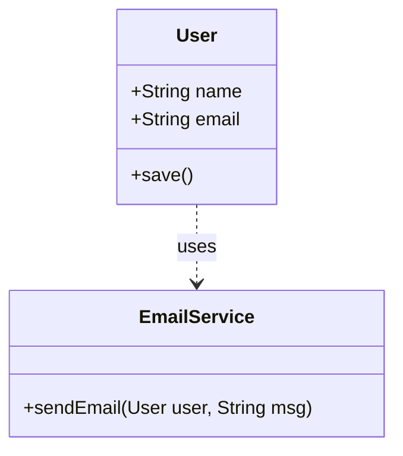
```mermaid
classDiagram
    class User {
        +String name
        +String email
        +save()
    }
    class EmailService {
        +sendEmail(User user, String msg)
    }
    User ..> EmailService : uses
```

```java
// Violation: User handles db and email
class User {
    void save() { ... }
    void sendEmail() { ... }
}

// Fix:
class User {
    void save() { /* database logic */ }
}
class EmailService {
    void sendEmail(User u) { /* email logic */ }
}
```

### 2. Open/Closed Principle (OCP)

**Definition:** Software entities should be open for extension, but closed for modification.
**Example:** Calculating area for different shapes.

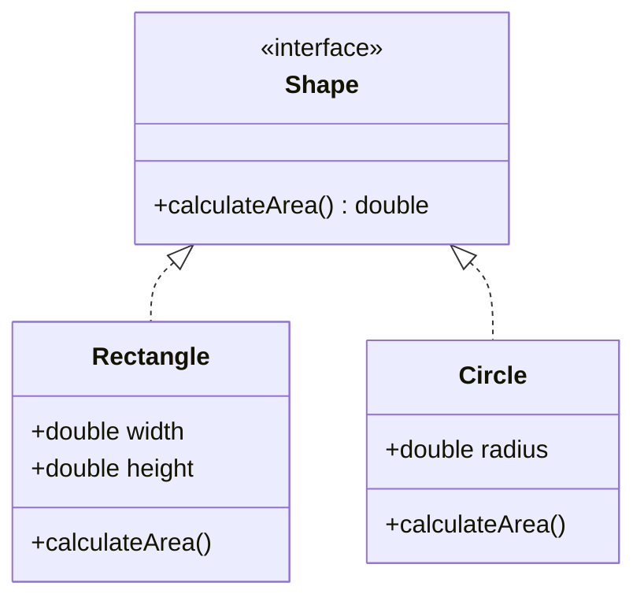
```mermaid
classDiagram
    class Shape {
        <<interface>>
        +calculateArea() double
    }
    class Rectangle {
        +double width
        +double height
        +calculateArea()
    }
    class Circle {
        +double radius
        +calculateArea()
    }
    Shape <|.. Rectangle
    Shape <|.. Circle
```

```java
interface Shape {
    double calculateArea();
}

class Rectangle implements Shape {
    public double calculateArea() { return width * height; }
}

class Circle implements Shape {
    public double calculateArea() { return Math.PI * radius * radius; }
}

// Adding a new shape (Triangle) doesn't modify existing code.
```

### 3. Liskov Substitution Principle (LSP)

**Definition:** Subtypes must be substitutable for their base types without altering the correctness of the program.
**Example:** The classic "Square is a Rectangle" problem.

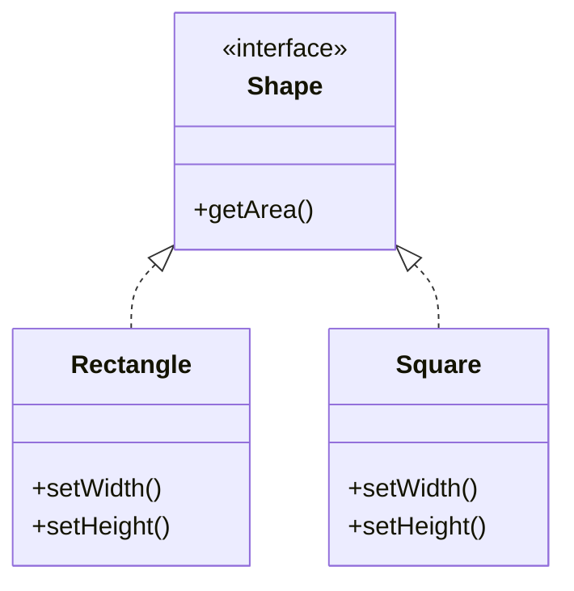
```mermaid
classDiagram
    class Shape {
        <<interface>>
        +getArea()
    }
    class Rectangle {
        +setWidth()
        +setHeight()
    }
    class Square {
        +setWidth()
        +setHeight()
    }
    Shape <|.. Rectangle
    Shape <|.. Square
```

```java
// Violation:
class Rectangle {
    void setWidth(int w) { this.w = w; }
    void setHeight(int h) { this.h = h; }
}
class Square extends Rectangle {
    void setWidth(int w) { super.setWidth(w); super.setHeight(w); } // Breaks behavior
}

// Fix: Use a common interface without inheritance relationship between them if behaviors differ significantly
interface Shape { int getArea(); }
class Rectangle implements Shape { ... }
class Square implements Shape { ... }
```

### 4. Interface Segregation Principle (ISP)

**Definition:** Clients should not be forced to depend on methods they do not use.
**Example:** A Multi-Function Printer vs a Simple Printer.

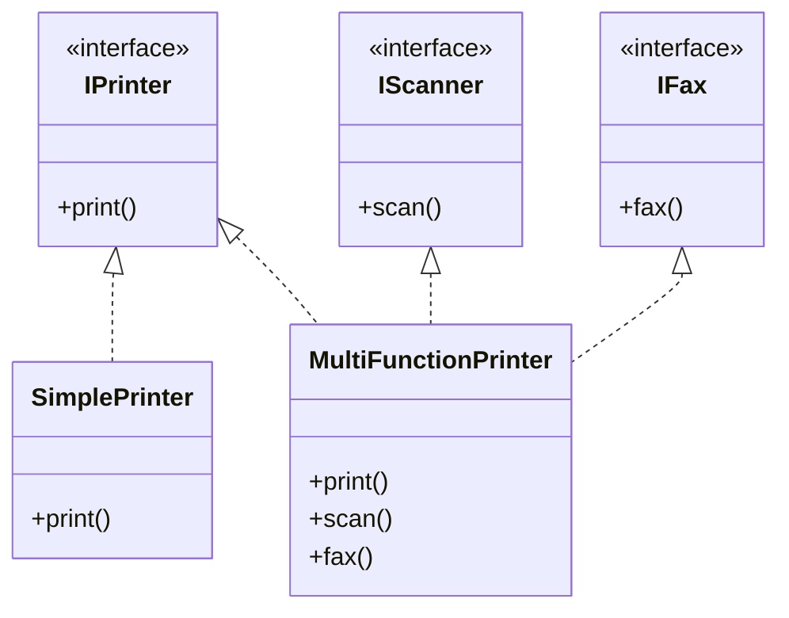
```mermaid
classDiagram
    class IPrinter {
        <<interface>>
        +print()
    }
    class IScanner {
        <<interface>>
        +scan()
    }
    class IFax {
        <<interface>>
        +fax()
    }
    class SimplePrinter {
        +print()
    }
    class MultiFunctionPrinter {
        +print()
        +scan()
        +fax()
    }
    IPrinter <|.. SimplePrinter
    IPrinter <|.. MultiFunctionPrinter
    IScanner <|.. MultiFunctionPrinter
    IFax <|.. MultiFunctionPrinter
```

```java
// Violation: SimplePrinter is forced to implement scan() and fax() it doesn't support
interface Machine {
    void print();
    void scan();
    void fax();
}

class SimplePrinter implements Machine {
    public void print() { /* works fine */ }
    public void scan() { throw new UnsupportedOperationException(); } // forced!
    public void fax()  { throw new UnsupportedOperationException(); } // forced!
}

// Fix: Segregate into focused interfaces — clients only depend on what they need
interface IPrinter { void print(); }
interface IScanner { void scan(); }
interface IFax     { void fax(); }

class SimplePrinter implements IPrinter {
    public void print() { /* only what it needs */ }
}

class MultiFunctionPrinter implements IPrinter, IScanner, IFax {
    public void print() { ... }
    public void scan()  { ... }
    public void fax()   { ... }
}
```

### 5. Dependency Inversion Principle (DIP)

**Definition:** High-level modules should not depend on low-level modules. Both should depend on abstractions.
**Example:** Order Service with a swappable database backend.

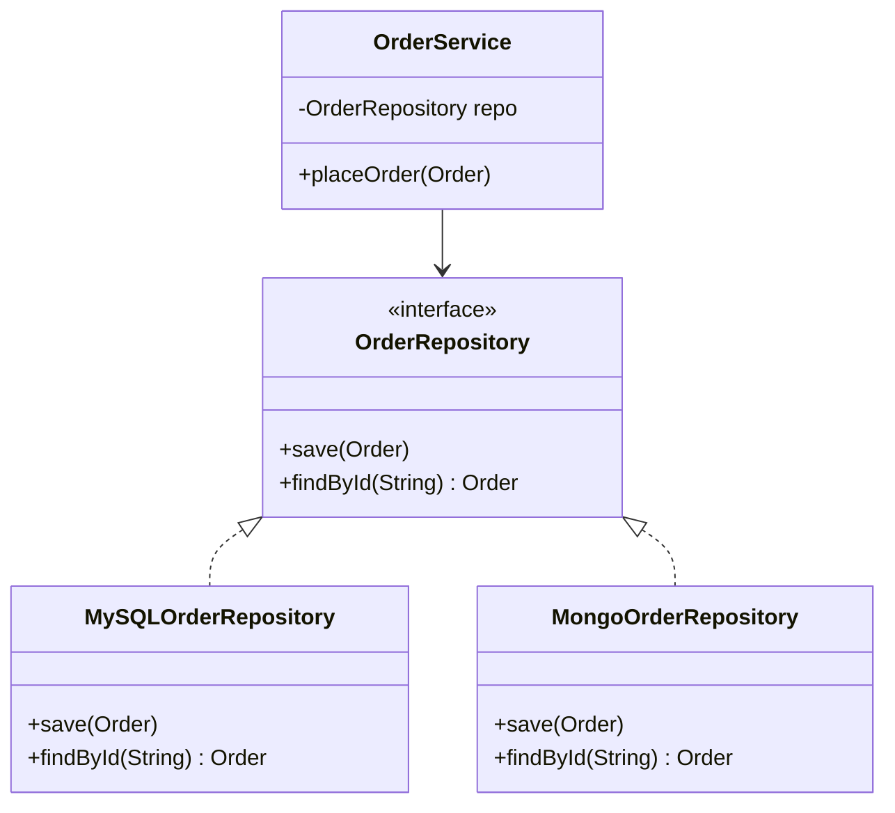
```mermaid
classDiagram
    class OrderService {
        -OrderRepository repo
        +placeOrder(Order)
    }
    class OrderRepository {
        <<interface>>
        +save(Order)
        +findById(String) Order
    }
    class MySQLOrderRepository {
        +save(Order)
        +findById(String) Order
    }
    class MongoOrderRepository {
        +save(Order)
        +findById(String) Order
    }
    OrderService --> OrderRepository
    OrderRepository <|.. MySQLOrderRepository
    OrderRepository <|.. MongoOrderRepository
```

```java
// Violation: OrderService (high-level) directly depends on MySQLDatabase (low-level)
// Swapping to MongoDB requires changing OrderService itself.
class OrderService {
    private MySQLDatabase db = new MySQLDatabase(); // tightly coupled!

    public void placeOrder(Order order) {
        db.save(order);
    }
}

// Fix: Both layers depend on the abstraction (OrderRepository)
interface OrderRepository {
    void save(Order order);
    Order findById(String id);
}

class MySQLOrderRepository implements OrderRepository {
    public void save(Order o)          { /* MySQL logic */ }
    public Order findById(String id)   { /* MySQL logic */ return null; }
}

class MongoOrderRepository implements OrderRepository {
    public void save(Order o)          { /* Mongo logic */ }
    public Order findById(String id)   { /* Mongo logic */ return null; }
}

// High-level module depends only on the abstraction — swapping DB needs zero changes here
class OrderService {
    private OrderRepository repo;
    public OrderService(OrderRepository repo) { this.repo = repo; }
    public void placeOrder(Order order) { repo.save(order); }
}
```

---

## Design Patterns

### Creational Patterns

> Deal with object creation mechanisms.

#### 1. Singleton

**Definition:** Ensures a class has only one instance and provides a global point of access to it.
**Example:** A shared `Logger` or `DatabaseConnection`.

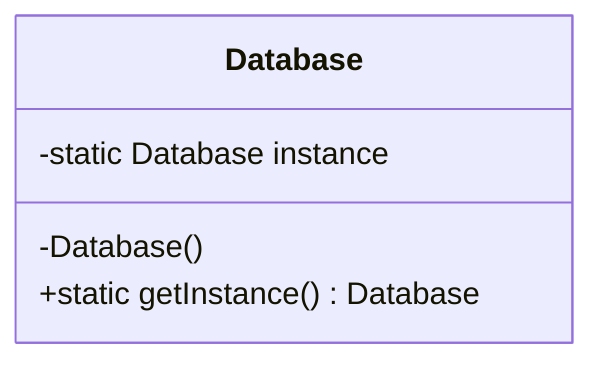
```mermaid
classDiagram
    class Database {
        -static Database instance
        -Database()
        +static getInstance() Database
    }
```

```java
// Simple (not thread-safe)
class Database {
    private static Database instance;
    private Database() {}
    public static Database getInstance() {
        if (instance == null) instance = new Database();
        return instance;
    }
}

// Thread-Safe: Double-Checked Locking
class Database {
    private static volatile Database instance;
    private Database() {}
    public static Database getInstance() {
        if (instance == null) {
            synchronized (Database.class) {
                if (instance == null) instance = new Database();
            }
        }
        return instance;
    }
}

// Thread-Safe: Eager Initialization (simplest)
class Database {
    private static final Database INSTANCE = new Database();
    private Database() {}
    public static Database getInstance() { return INSTANCE; }
}
```

#### 2. Simple Factory

**Definition:** A single class with a static method that decides which subtype to instantiate based on input. Not a formal GoF pattern but commonly used.
**Example:** A `ShapeFactory` that returns the right `Shape` object.

```java
class ShapeFactory {
    public static Shape getShape(String type) {
        switch (type) {
            case "CIRCLE":    return new Circle();
            case "RECTANGLE": return new Rectangle();
            default: throw new IllegalArgumentException("Unknown shape: " + type);
        }
    }
}

// Usage
Shape s = ShapeFactory.getShape("CIRCLE");
```

#### 3. Factory Method

**Definition:** Defines an interface for creating an object, but lets subclasses decide which class to instantiate.
**Example:** Logistics (Truck vs Ship).

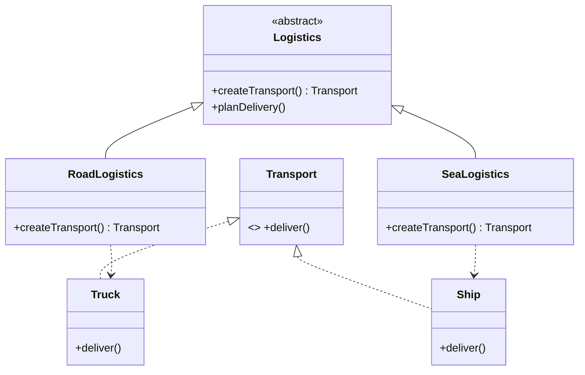
```mermaid
classDiagram
    class Logistics {
        <<abstract>>
        +createTransport() Transport
        +planDelivery()
    }
    class RoadLogistics {
        +createTransport() Transport
    }
    class SeaLogistics {
        +createTransport() Transport
    }
    class Transport { <<interface>> +deliver() }
    class Truck { +deliver() }
    class Ship  { +deliver() }
    Logistics <|-- RoadLogistics
    Logistics <|-- SeaLogistics
    Transport <|.. Truck
    Transport <|.. Ship
    RoadLogistics ..> Truck
    SeaLogistics ..> Ship
```

```java
interface Transport { void deliver(); }

abstract class Logistics {
    abstract Transport createTransport();   // factory method
    public void planDelivery() { createTransport().deliver(); }
}

class RoadLogistics extends Logistics {
    public Transport createTransport() { return new Truck(); }
}

class SeaLogistics extends Logistics {
    public Transport createTransport() { return new Ship(); }
}
```

#### 4. Abstract Factory

**Definition:** Provides an interface for creating _families_ of related objects without specifying concrete classes.
**Example:** A UI toolkit factory that produces consistent Button + Checkbox widgets for Windows or Mac.

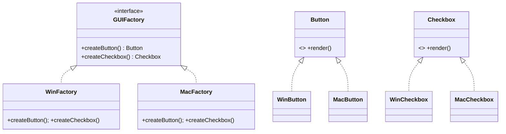
```mermaid
classDiagram
    class GUIFactory {
        <<interface>>
        +createButton() Button
        +createCheckbox() Checkbox
    }
    class WinFactory  { +createButton(); +createCheckbox() }
    class MacFactory  { +createButton(); +createCheckbox() }
    class Button   { <<interface>> +render() }
    class Checkbox { <<interface>> +render() }
    GUIFactory <|.. WinFactory
    GUIFactory <|.. MacFactory
    Button   <|.. WinButton
    Button   <|.. MacButton
    Checkbox <|.. WinCheckbox
    Checkbox <|.. MacCheckbox
```

```java
interface Button   { void render(); }
interface Checkbox { void render(); }
interface GUIFactory {
    Button   createButton();
    Checkbox createCheckbox();
}

class WinFactory implements GUIFactory {
    public Button   createButton()   { return new WinButton(); }
    public Checkbox createCheckbox() { return new WinCheckbox(); }
}

class MacFactory implements GUIFactory {
    public Button   createButton()   { return new MacButton(); }
    public Checkbox createCheckbox() { return new MacCheckbox(); }
}
```

#### 5. Builder

**Definition:** Constructs complex objects step-by-step. Separates construction from representation, allowing the same process to produce different results.
**Example:** Building a `Pizza` with optional toppings — avoids a telescoping constructor.

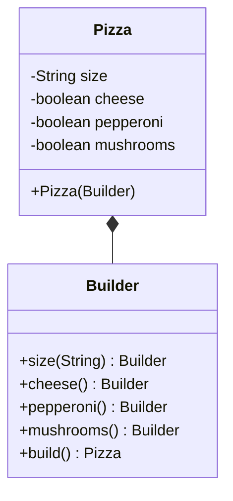
```mermaid
classDiagram
    class Pizza {
        -String size
        -boolean cheese
        -boolean pepperoni
        -boolean mushrooms
        +Pizza(Builder)
    }
    class Builder {
        +size(String) Builder
        +cheese() Builder
        +pepperoni() Builder
        +mushrooms() Builder
        +build() Pizza
    }
    Pizza *-- Builder
```

```java
// Without Builder — hard to read with many optional fields
Pizza p = new Pizza("large", true, false, true, false, true);

// With Builder — self-documenting, flexible
class Pizza {
    private String size;
    private boolean cheese, pepperoni, mushrooms;

    private Pizza(Builder b) {
        this.size = b.size; this.cheese = b.cheese;
        this.pepperoni = b.pepperoni; this.mushrooms = b.mushrooms;
    }

    static class Builder {
        private String size;
        private boolean cheese, pepperoni, mushrooms;
        Builder(String size)   { this.size = size; }
        Builder cheese()       { cheese = true;    return this; }
        Builder pepperoni()    { pepperoni = true; return this; }
        Builder mushrooms()    { mushrooms = true; return this; }
        Pizza build()          { return new Pizza(this); }
    }
}

Pizza p = new Pizza.Builder("large").cheese().mushrooms().build();
```

#### 6. Prototype

**Definition:** Creates new objects by cloning an existing object (the prototype), instead of creating from scratch.
**Example:** Cloning a complex `Shape` configuration to avoid expensive re-initialization.

```java
// Without Prototype — costly re-creation every time
Shape s2 = new Circle(existingCircle.getRadius(), existingCircle.getColor(), ...);

// With Prototype — cheap copy
abstract class Shape implements Cloneable {
    String color;
    abstract Shape clone();
}

class Circle extends Shape {
    int radius;
    public Circle clone() {
        Circle c = new Circle();
        c.radius = this.radius;
        c.color  = this.color;
        return c;
    }
}

Circle original = new Circle();
Circle copy = original.clone(); // fast copy, no constructor args needed
```

---

### Structural Patterns

> Deal with object composition and relationships.

#### 7. Adapter

**Definition:** Converts the interface of a class into another interface that clients expect.
**Example:** Plugging a `LightningPhone` into a USB port.

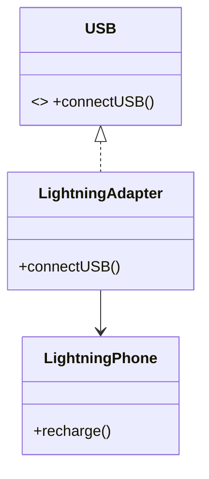
```mermaid
classDiagram
    class USB { <<interface>> +connectUSB() }
    class LightningPhone { +recharge() }
    class LightningAdapter { +connectUSB() }
    USB <|.. LightningAdapter
    LightningAdapter --> LightningPhone
```

```java
interface USB { void connectUSB(); }
class LightningPhone { void recharge() { System.out.println("Charging..."); } }

class LightningAdapter implements USB {
    private LightningPhone phone;
    public LightningAdapter(LightningPhone p) { this.phone = p; }
    public void connectUSB() { phone.recharge(); }
}
```

#### 8. Decorator

**Definition:** Attaches additional responsibilities to an object dynamically, as a flexible alternative to subclassing.
**Example:** Adding Milk and Sugar to a Coffee object at runtime.

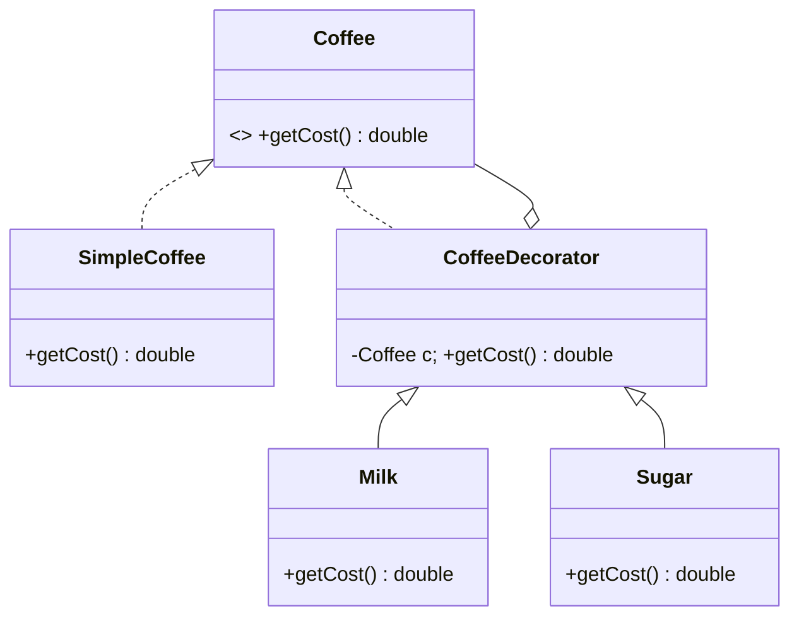
```mermaid
classDiagram
    class Coffee { <<interface>> +getCost() double }
    class SimpleCoffee  { +getCost() double }
    class CoffeeDecorator { -Coffee c; +getCost() double }
    class Milk  { +getCost() double }
    class Sugar { +getCost() double }
    Coffee <|.. SimpleCoffee
    Coffee <|.. CoffeeDecorator
    CoffeeDecorator <|-- Milk
    CoffeeDecorator <|-- Sugar
    CoffeeDecorator o-- Coffee
```

```java
interface Coffee { double getCost(); }
class SimpleCoffee implements Coffee { public double getCost() { return 5; } }

abstract class CoffeeDecorator implements Coffee {
    protected Coffee coffee;
    CoffeeDecorator(Coffee c) { this.coffee = c; }
    public double getCost() { return coffee.getCost(); }
}

class Milk extends CoffeeDecorator {
    Milk(Coffee c) { super(c); }
    public double getCost() { return super.getCost() + 2; }
}

class Sugar extends CoffeeDecorator {
    Sugar(Coffee c) { super(c); }
    public double getCost() { return super.getCost() + 1; }
}

// Usage: wrap at runtime
Coffee c = new Sugar(new Milk(new SimpleCoffee())); // 5 + 2 + 1 = 8
```

#### 9. Facade

**Definition:** Provides a simplified interface to a complex subsystem.
**Example:** `HomeTheaterFacade.watchMovie()` hides Projector, Amplifier, DVD coordination.

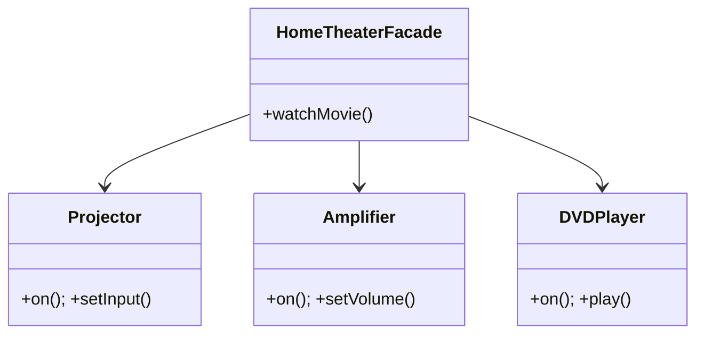
```mermaid
classDiagram
    class HomeTheaterFacade { +watchMovie() }
    class Projector { +on(); +setInput() }
    class Amplifier  { +on(); +setVolume() }
    class DVDPlayer  { +on(); +play() }
    HomeTheaterFacade --> Projector
    HomeTheaterFacade --> Amplifier
    HomeTheaterFacade --> DVDPlayer
```

```java
class HomeTheaterFacade {
    private Projector projector;
    private Amplifier amp;
    private DVDPlayer dvd;

    public void watchMovie(String movie) {
        projector.on(); projector.setInput(dvd);
        amp.on(); amp.setVolume(10);
        dvd.on(); dvd.play(movie);
    }
}
```

#### 10. Composite

**Definition:** Composes objects into tree structures to represent part-whole hierarchies. Clients treat individual objects and compositions uniformly.
**Example:** A file system where `File` and `Directory` are treated the same via a common `FileSystemItem` interface.

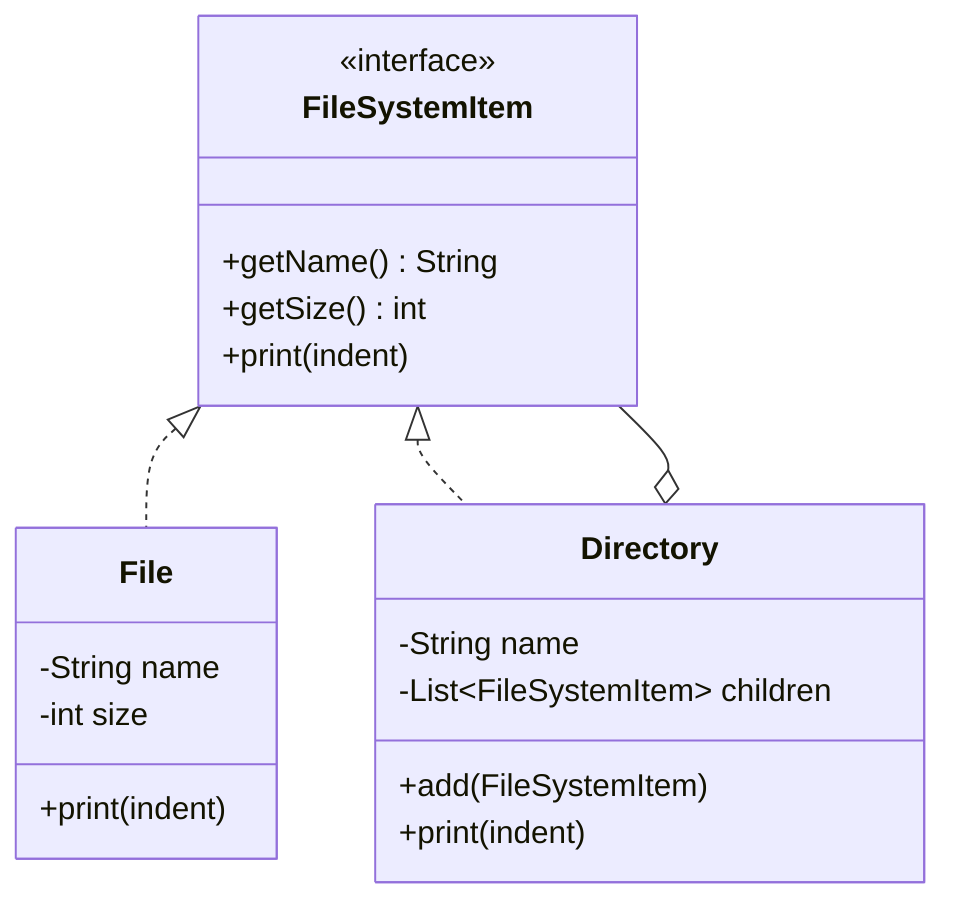
```mermaid
classDiagram
    class FileSystemItem {
        <<interface>>
        +getName() String
        +getSize() int
        +print(indent)
    }
    class File {
        -String name
        -int size
        +print(indent)
    }
    class Directory {
        -String name
        -List~FileSystemItem~ children
        +add(FileSystemItem)
        +print(indent)
    }
    FileSystemItem <|.. File
    FileSystemItem <|.. Directory
    Directory o-- FileSystemItem
```

```java
interface FileSystemItem {
    String getName();
    int    getSize();
    void   print(String indent);
}

class File implements FileSystemItem {
    private String name; private int size;
    File(String name, int size) { this.name = name; this.size = size; }
    public String getName() { return name; }
    public int    getSize() { return size; }
    public void   print(String indent) { System.out.println(indent + name + " (" + size + "kb)"); }
}

class Directory implements FileSystemItem {
    private String name;
    private List<FileSystemItem> children = new ArrayList<>();
    Directory(String name) { this.name = name; }
    public void add(FileSystemItem item) { children.add(item); }
    public int getSize() { return children.stream().mapToInt(FileSystemItem::getSize).sum(); }
    public void print(String indent) {
        System.out.println(indent + name + "/");
        children.forEach(c -> c.print(indent + "  "));
    }
}
```

#### 11. Proxy

**Definition:** Provides a surrogate that controls access to another object. Three main types: **Virtual** (lazy init), **Protection** (access control), **Remote** (local stand-in for remote object).
**Example:** A `ProxyImage` that defers loading a real image until `display()` is actually called.

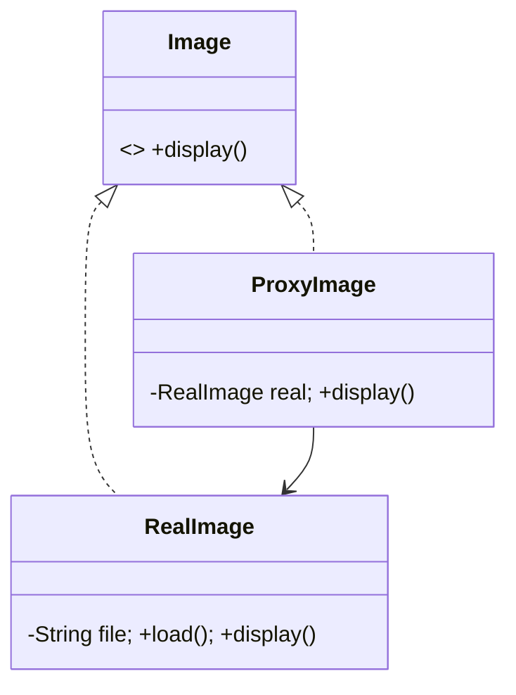
```mermaid
classDiagram
    class Image { <<interface>> +display() }
    class RealImage  { -String file; +load(); +display() }
    class ProxyImage { -RealImage real; +display() }
    Image <|.. RealImage
    Image <|.. ProxyImage
    ProxyImage --> RealImage
```

```java
interface Image { void display(); }

class RealImage implements Image {
    private String filename;
    RealImage(String f) { this.filename = f; loadFromDisk(); }
    private void loadFromDisk() { System.out.println("Loading " + filename); }
    public void display() { System.out.println("Displaying " + filename); }
}

// Virtual Proxy — defers expensive construction until needed
class ProxyImage implements Image {
    private RealImage realImage;
    private String filename;
    ProxyImage(String f) { this.filename = f; }
    public void display() {
        if (realImage == null) realImage = new RealImage(filename); // lazy load
        realImage.display();
    }
}
```

#### 12. Bridge

**Definition:** Decouples an abstraction from its implementation so the two can vary independently.
**Example:** A `Shape` (abstraction) uses a `DrawAPI` (implementation) — you can mix any shape with any renderer.

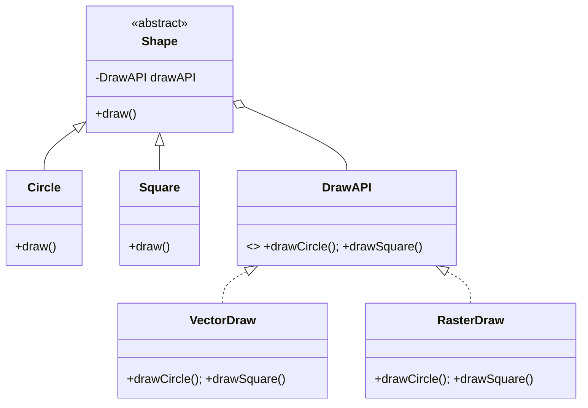
```mermaid
classDiagram
    class Shape {
        <<abstract>>
        -DrawAPI drawAPI
        +draw()
    }
    class Circle  { +draw() }
    class Square  { +draw() }
    class DrawAPI { <<interface>> +drawCircle(); +drawSquare() }
    class VectorDraw { +drawCircle(); +drawSquare() }
    class RasterDraw { +drawCircle(); +drawSquare() }
    Shape <|-- Circle
    Shape <|-- Square
    Shape o-- DrawAPI
    DrawAPI <|.. VectorDraw
    DrawAPI <|.. RasterDraw
```

```java
interface DrawAPI { void drawCircle(int r); }

abstract class Shape {
    protected DrawAPI drawAPI;
    Shape(DrawAPI api) { this.drawAPI = api; }
    abstract void draw();
}

class Circle extends Shape {
    private int radius;
    Circle(int r, DrawAPI api) { super(api); this.radius = r; }
    public void draw() { drawAPI.drawCircle(radius); }
}

// Mix freely: Circle + VectorDraw, Circle + RasterDraw, Square + VectorDraw, ...
```

#### 13. Flyweight

**Definition:** Uses sharing to support a large number of fine-grained objects efficiently. Separates **intrinsic** (shared) state from **extrinsic** (unique) state.
**Example:** A forest of 1 million trees — share `TreeType` (texture, colour) instead of duplicating it per tree.

```java
// Without Flyweight — each Tree stores its own type data (wasteful)
class Tree { String type; String texture; String color; int x; int y; }

// With Flyweight — share the heavy type object
class TreeType {                          // intrinsic (shared)
    String name, texture, color;
    void draw(int x, int y) { /* render at (x,y) */ }
}

class Tree {                              // extrinsic (unique per tree)
    int x, y;
    TreeType type;                        // reference to shared object
    void draw() { type.draw(x, y); }
}

class TreeFactory {
    private static Map<String, TreeType> cache = new HashMap<>();
    public static TreeType get(String name, String texture, String color) {
        return cache.computeIfAbsent(name, k -> new TreeType(name, texture, color));
    }
}
```

---

### Behavioral Patterns

> Deal with communication and responsibilities between objects.

#### 14. Strategy

**Definition:** Defines a family of algorithms, encapsulates each one, and makes them interchangeable. Lets the algorithm vary independently from the clients that use it.
**Example:** A `Navigator` that can use different route-calculation strategies (Road, Walking, Transit).

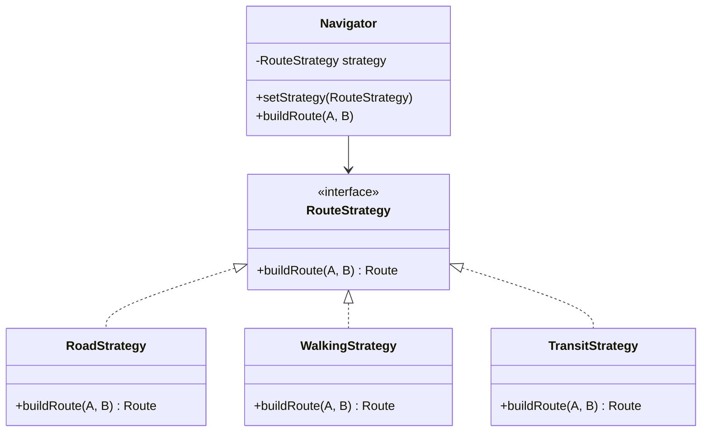
```mermaid
classDiagram
    class RouteStrategy {
        <<interface>>
        +buildRoute(A, B) Route
    }
    class RoadStrategy    { +buildRoute(A, B) Route }
    class WalkingStrategy { +buildRoute(A, B) Route }
    class TransitStrategy { +buildRoute(A, B) Route }
    class Navigator {
        -RouteStrategy strategy
        +setStrategy(RouteStrategy)
        +buildRoute(A, B)
    }
    Navigator --> RouteStrategy
    RouteStrategy <|.. RoadStrategy
    RouteStrategy <|.. WalkingStrategy
    RouteStrategy <|.. TransitStrategy
```

```java
interface RouteStrategy { Route buildRoute(String a, String b); }

class RoadStrategy    implements RouteStrategy { public Route buildRoute(String a, String b) { /*fast road*/ } }
class WalkingStrategy implements RouteStrategy { public Route buildRoute(String a, String b) { /*walking path*/ } }

class Navigator {
    private RouteStrategy strategy;
    public void setStrategy(RouteStrategy s) { this.strategy = s; }
    public Route buildRoute(String a, String b) { return strategy.buildRoute(a, b); }
}

// Swap strategy at runtime
navigator.setStrategy(new WalkingStrategy());
```

#### 15. Observer

**Definition:** Defines a one-to-many dependency so that when one object changes state, all dependents are notified automatically.
**Example:** A YouTube channel notifying all subscribers when a new video is uploaded.

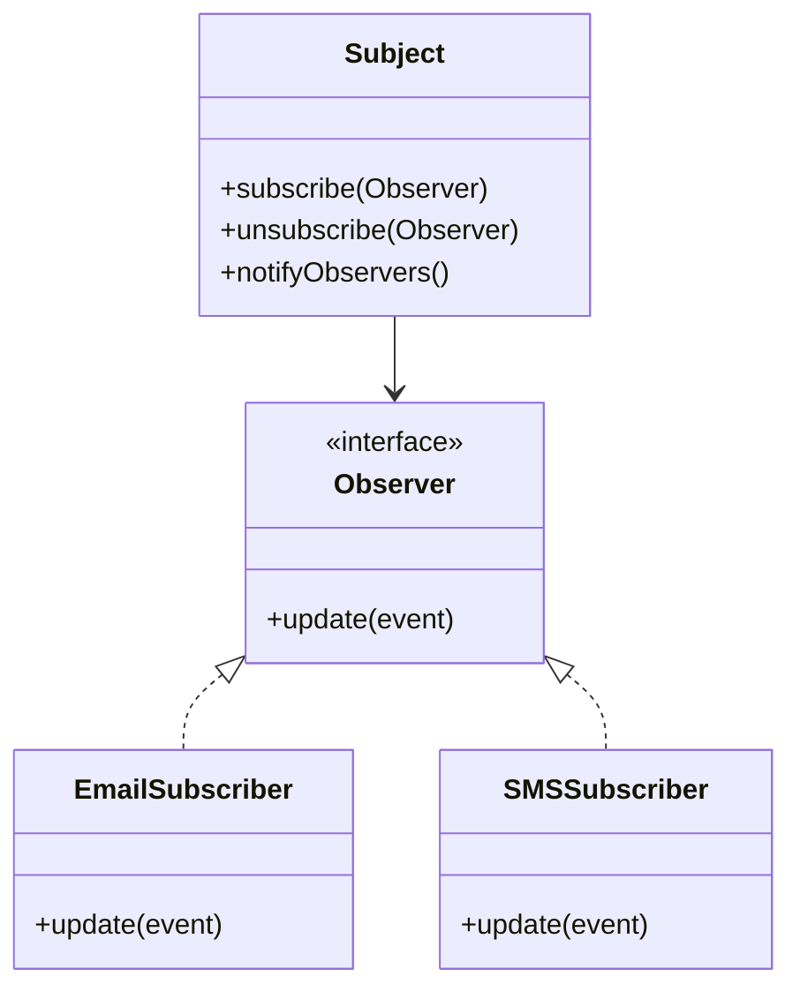
```mermaid
classDiagram
    class Subject {
        +subscribe(Observer)
        +unsubscribe(Observer)
        +notifyObservers()
    }
    class Observer {
        <<interface>>
        +update(event)
    }
    class EmailSubscriber { +update(event) }
    class SMSSubscriber   { +update(event) }
    Subject --> Observer
    Observer <|.. EmailSubscriber
    Observer <|.. SMSSubscriber
```

```java
interface Observer { void update(String event); }

class Channel {
    private List<Observer> subscribers = new ArrayList<>();
    public void subscribe(Observer o)   { subscribers.add(o); }
    public void unsubscribe(Observer o) { subscribers.remove(o); }
    public void uploadVideo(String title) {
        System.out.println("New video: " + title);
        subscribers.forEach(o -> o.update(title));
    }
}

class EmailSubscriber implements Observer {
    public void update(String event) { System.out.println("Email: new video — " + event); }
}
```

#### 16. Command

**Definition:** Encapsulates a request as an object, enabling undo/redo, queuing, and logging.
**Example:** A Smart Home remote where each button press is a `Command` object.

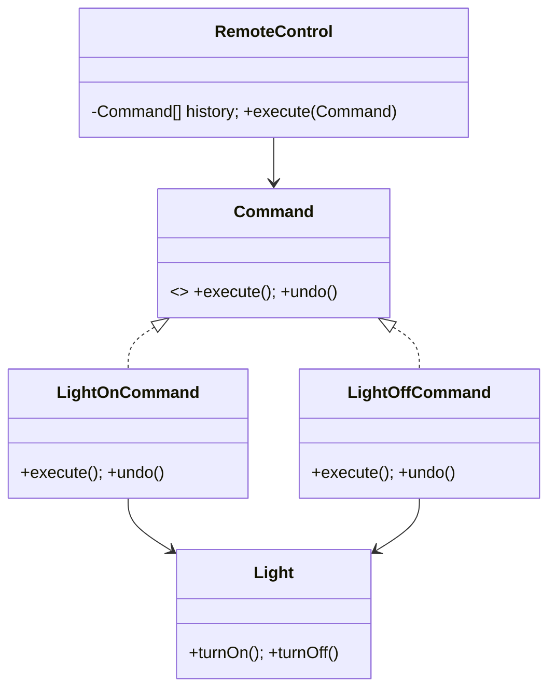
```mermaid
classDiagram
    class Command { <<interface>> +execute(); +undo() }
    class LightOnCommand  { +execute(); +undo() }
    class LightOffCommand { +execute(); +undo() }
    class Light { +turnOn(); +turnOff() }
    class RemoteControl { -Command[] history; +execute(Command) }
    Command <|.. LightOnCommand
    Command <|.. LightOffCommand
    LightOnCommand  --> Light
    LightOffCommand --> Light
    RemoteControl   --> Command
```

```java
interface Command { void execute(); void undo(); }

class LightOnCommand implements Command {
    private Light light;
    LightOnCommand(Light l) { this.light = l; }
    public void execute() { light.turnOn(); }
    public void undo()    { light.turnOff(); }
}

class RemoteControl {
    private Deque<Command> history = new ArrayDeque<>();
    public void execute(Command c) { c.execute(); history.push(c); }
    public void undoLast()         { if (!history.isEmpty()) history.pop().undo(); }
}
```

#### 17. Template Method

**Definition:** Defines the skeleton of an algorithm in a base class, deferring some steps to subclasses. Subclasses can override specific steps without changing the overall structure.
**Example:** A `DataProcessor` that has a fixed `process()` pipeline but lets subclasses define `readData()` and `processData()`.

```mermaid
classDiagram
    class DataProcessor {
        +process()
        +readData()*
        +processData()*
        +saveResults()
    }
    class CSVProcessor  { +readData(); +processData() }
    class JSONProcessor { +readData(); +processData() }
    DataProcessor <|-- CSVProcessor
    DataProcessor <|-- JSONProcessor
```

```java
abstract class DataProcessor {
    // Template method — the fixed algorithm skeleton
    public final void process() {
        readData();
        processData();
        saveResults();         // shared step
    }

    abstract void readData();
    abstract void processData();

    void saveResults() { System.out.println("Saving results to DB..."); }
}

class CSVProcessor extends DataProcessor {
    void readData()    { System.out.println("Reading CSV file..."); }
    void processData() { System.out.println("Parsing CSV rows..."); }
}
```

#### 18. Iterator

**Definition:** Provides a way to sequentially access elements of a collection without exposing its underlying representation.
**Example:** A custom `BookCollection` that can be iterated without knowing it's backed by a list.

```java
interface Iterator<T> { boolean hasNext(); T next(); }

class BookCollection {
    private List<String> books = new ArrayList<>();
    public void add(String b) { books.add(b); }

    public Iterator<String> iterator() {
        return new Iterator<String>() {
            int index = 0;
            public boolean hasNext() { return index < books.size(); }
            public String  next()    { return books.get(index++); }
        };
    }
}

// Usage
Iterator<String> it = library.iterator();
while (it.hasNext()) System.out.println(it.next());
```

#### 19. Chain of Responsibility (CoR)

**Definition:** Passes a request along a chain of handlers. Each handler decides either to process the request or pass it to the next handler.
**Example:** A support ticket system where Level 1 → Level 2 → Level 3 support handle by escalation.

```mermaid
classDiagram
    class Handler {
        <<abstract>>
        -Handler next
        +setNext(Handler)
        +handle(request)*
    }
    class L1Support { +handle(request) }
    class L2Support { +handle(request) }
    class L3Support { +handle(request) }
    Handler <|-- L1Support
    Handler <|-- L2Support
    Handler <|-- L3Support
    Handler --> Handler : next
```

```java
abstract class Handler {
    protected Handler next;
    public Handler setNext(Handler h) { this.next = h; return h; }
    public abstract void handle(int level, String issue);
}

class L1Support extends Handler {
    public void handle(int level, String issue) {
        if (level <= 1) System.out.println("L1 resolved: " + issue);
        else if (next != null) next.handle(level, issue);
    }
}

// Chain setup
Handler l1 = new L1Support();
Handler l2 = new L2Support();
Handler l3 = new L3Support();
l1.setNext(l2).setNext(l3); // l1 → l2 → l3

l1.handle(2, "Login issue"); // escalates to L2
```

#### 20. State

**Definition:** Allows an object to change its behaviour when its internal state changes. The object will appear to change its class.
**Example:** A vending machine behaves differently depending on whether it has no coins, has coins, or is out of stock.

```mermaid
classDiagram
    class VendingMachine {
        -State currentState
        +insertCoin()
        +selectProduct()
        +dispense()
    }
    class State { <<interface>> +insertCoin(); +selectProduct(); +dispense() }
    class NoCoinState   { +insertCoin(); +selectProduct(); +dispense() }
    class HasCoinState  { +insertCoin(); +selectProduct(); +dispense() }
    class OutOfStock    { +insertCoin(); +selectProduct(); +dispense() }
    VendingMachine --> State
    State <|.. NoCoinState
    State <|.. HasCoinState
    State <|.. OutOfStock
```

```java
interface State {
    void insertCoin();
    void selectProduct();
    void dispense();
}

class NoCoinState implements State {
    private VendingMachine machine;
    NoCoinState(VendingMachine m) { this.machine = m; }
    public void insertCoin()     { System.out.println("Coin inserted"); machine.setState(machine.getHasCoinState()); }
    public void selectProduct()  { System.out.println("Insert coin first"); }
    public void dispense()       { System.out.println("Insert coin first"); }
}
// Each state handles its allowed transitions; illegal operations print an error.
```

#### 21. Mediator

**Definition:** Defines an object that encapsulates how a set of objects interact. Promotes loose coupling by preventing objects from referring to each other explicitly.
**Example:** An air traffic control tower — planes don't talk to each other; they all communicate through the tower.

```mermaid
classDiagram
    class Mediator {
        <<interface>>
        +notify(sender, event)
    }
    class ATCTower { +notify(sender, event) }
    class Aircraft  { -Mediator atc; +land(); +takeoff() }
    Mediator <|.. ATCTower
    Aircraft --> Mediator
```

```java
interface Mediator { void notify(Aircraft sender, String event); }

class ATCTower implements Mediator {
    private List<Aircraft> registry = new ArrayList<>();
    public void register(Aircraft a) { registry.add(a); }
    public void notify(Aircraft sender, String event) {
        registry.stream()
            .filter(a -> a != sender)
            .forEach(a -> a.receive(event + " from " + sender.getCallsign()));
    }
}

class Aircraft {
    private String callsign;
    private Mediator atc;
    void land()    { atc.notify(this, "LANDING"); }
    void receive(String msg) { System.out.println(callsign + " received: " + msg); }
}
```

#### 22. Visitor

**Definition:** Lets you add further operations to objects without modifying them. The visitor class implements the operation, while the element class accepts the visitor.
**Example:** A tax calculator that visits different `Expense` types without modifying the expense classes.

```mermaid
classDiagram
    class Visitor { <<interface>> +visitFood(Food); +visitTravel(Travel) }
    class TaxVisitor  { +visitFood(Food); +visitTravel(Travel) }
    class Element { <<interface>> +accept(Visitor) }
    class Food   { +accept(Visitor) }
    class Travel { +accept(Visitor) }
    Visitor   <|.. TaxVisitor
    Element   <|.. Food
    Element   <|.. Travel
    Food   --> Visitor
    Travel --> Visitor
```

```java
interface Visitor { void visitFood(Food f); void visitTravel(Travel t); }

class TaxVisitor implements Visitor {
    public void visitFood(Food f)     { System.out.println("Food tax: " + f.getCost() * 0.05); }
    public void visitTravel(Travel t) { System.out.println("Travel tax: " + t.getCost() * 0.18); }
}

interface Element { void accept(Visitor v); }

class Food implements Element {
    private double cost;
    Food(double c) { this.cost = c; }
    public double getCost() { return cost; }
    public void accept(Visitor v) { v.visitFood(this); }
}

// Usage — new operations (DiscountVisitor, AuditVisitor) without touching Food/Travel
List<Element> expenses = List.of(new Food(100), new Travel(500));
expenses.forEach(e -> e.accept(new TaxVisitor()));
```

#### 23. Memento

**Definition:** Captures and externalizes an object's internal state so it can be restored later, without violating encapsulation.
**Example:** Text editor undo — save snapshots of `TextEditor` state before each change.

```mermaid
classDiagram
    class TextEditor {
        -String content
        +type(String)
        +save() Memento
        +restore(Memento)
    }
    class Memento {
        -String state
        +getState() String
    }
    class History {
        -Stack~Memento~ stack
        +push(Memento)
        +pop() Memento
    }
    TextEditor --> Memento
    History    o-- Memento
```

```java
class Memento {
    private final String state;
    Memento(String s) { this.state = s; }
    String getState() { return state; }
}

class TextEditor {
    private String content = "";
    public void type(String text)      { content += text; }
    public Memento save()              { return new Memento(content); }
    public void restore(Memento m)     { content = m.getState(); }
    public String getContent()         { return content; }
}

class History {
    private Deque<Memento> stack = new ArrayDeque<>();
    public void push(Memento m) { stack.push(m); }
    public Memento pop()        { return stack.pop(); }
}

// Usage
TextEditor editor = new TextEditor();
History history = new History();
editor.type("Hello");   history.push(editor.save());
editor.type(" World");  // oops
editor.restore(history.pop()); // back to "Hello"
```

---

## LLD Projects

Real-world system design problems from the course (each applies multiple patterns):

| Lecture | Project                        | Key Patterns Used                          |
| ------- | ------------------------------ | ------------------------------------------ |
| 11      | Food Ordering App (Tomato)     | Strategy, Factory, Singleton               |
| 14      | Notification System            | Observer, Decorator, Strategy              |
| 18      | Music Player                   | State, Observer, Command                   |
| 23      | Payment Gateway                | Strategy, Factory, Chain of Responsibility |
| 24      | Discount Coupon System         | Chain of Responsibility                    |
| 26      | Zepto Clone (Grocery Delivery) | Factory, Strategy, Observer                |
| 27      | Tinder Clone                   | Strategy, Observer                         |
| 31      | Splitwise App                  | Strategy, Observer, Composite              |
| 32      | Vending Machine                | State                                      |
| 33      | TicTacToe                      | Command, State                             |
| 34      | Snake and Ladder               | Observer, Strategy                         |
| 37      | Chess                          | Composite, Iterator, Command               |

---

## Other Concepts

### Principle of Least Knowledge (Law of Demeter)

**Definition:** A module should not know about the innards of the objects it manipulats. "Only talk to your immediate friends."
**Rule:** A method `M` of object `O` should only invoke methods of:

1. `O` itself.
2. Parameters passed to `M`.
3. Objects created within `M`.
4. Direct component objects of `O`.

**Bad:** `customer.getWallet().getBank().withdraw()`
**Good:** `customer.withdrawPayment()` (Delegation)

### Association

**Definition:** Association is a "has-a" or "uses-a" relationship between two classes where there is no ownership. They have their own lifecycle.

- **Aggregation:** "Has-a" with weak ownership (Classroom has Students; Students exist without Classroom).
- **Composition:** "Has-a" with strong ownership (House has Rooms; Rooms cannot exist without House).
