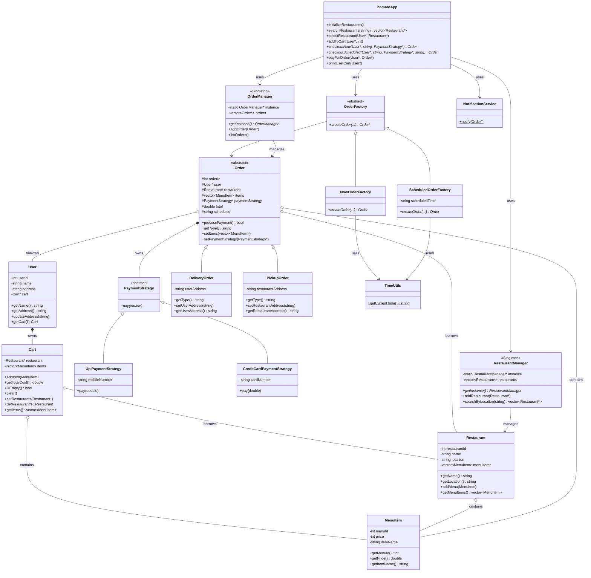

# Zomato Low-Level Design - Class Diagram

```mermaid
classDiagram
    direction TB

    class MenuItem {
        -int menuId
        -int price
        -string itemName
        +getMenuId() int
        +getPrice() double
        +getItemName() string
    }

    class Restaurant {
        -int restaurantId
        -string name
        -string location
        -vector~MenuItem~ menuItems
        +getName() string
        +getLocation() string
        +addMenu(MenuItem)
        +getMenuItems() vector~MenuItem~
    }

    class Cart {
        -Restaurant* restaurant
        -vector~MenuItem~ items
        +addItem(MenuItem)
        +getTotalCost() double
        +isEmpty() bool
        +clear()
        +setRestaurants(Restaurant*)
        +getRestaurant() Restaurant*
        +getItems() vector~MenuItem~
    }

    class User {
        -int userId
        -string name
        -string address
        -Cart* cart
        +getName() string
        +getAddress() string
        +updateAddress(string)
        +getCart() Cart*
    }

    class PaymentStrategy {
        <<abstract>>
        +pay(double)*
    }

    class UpiPaymentStrategy {
        -string mobileNumber
        +pay(double)
    }

    class CreditCardPaymentStrategy {
        -string cardNumber
        +pay(double)
    }

    class Order {
        <<abstract>>
        #int orderId
        #User* user
        #Restaurant* restaurant
        #vector~MenuItem~ items
        #PaymentStrategy* paymentStrategy
        #double total
        #string scheduled
        +processPayment() bool
        +getType() string*
        +setItems(vector~MenuItem~)
        +setPaymentStrategy(PaymentStrategy*)
    }

    class DeliveryOrder {
        -string userAddress
        +getType() string
        +setUserAddress(string)
        +getUserAddress() string
    }

    class PickupOrder {
        -string restaurantAddress
        +getType() string
        +setRestaurantAddress(string)
        +getRestaurantAddress() string
    }

    class OrderFactory {
        <<abstract>>
        +createOrder(...)* Order*
    }

    class NowOrderFactory {
        +createOrder(...) Order*
    }

    class ScheduledOrderFactory {
        -string scheduledTime
        +createOrder(...) Order*
    }

    class RestaurantManager {
        <<Singleton>>
        -static RestaurantManager* instance
        -vector~Restaurant*~ restaurants
        +getInstance() RestaurantManager*
        +addRestaurant(Restaurant*)
        +searchByLocation(string) vector~Restaurant*~
    }

    class OrderManager {
        <<Singleton>>
        -static OrderManager* instance
        -vector~Order*~ orders
        +getInstance() OrderManager*
        +addOrder(Order*)
        +listOrders()
    }

    class NotificationService {
        +notify(Order*)$
    }

    class TimeUtils {
        +getCurrentTime()$ string
    }

    class ZomatoApp {
        +initializeRestaurants()
        +searchRestaurants(string) vector~Restaurant*~
        +selectRestaurant(User*, Restaurant*)
        +addToCart(User*, int)
        +checkoutNow(User*, string, PaymentStrategy*) Order*
        +checkoutScheduled(User*, string, PaymentStrategy*, string) Order*
        +payForOrder(User*, Order*)
        +printUserCart(User*)
    }

    PaymentStrategy <|-- UpiPaymentStrategy
    PaymentStrategy <|-- CreditCardPaymentStrategy
    Order <|-- DeliveryOrder
    Order <|-- PickupOrder
    OrderFactory <|-- NowOrderFactory
    OrderFactory <|-- ScheduledOrderFactory

    User *-- Cart : owns
    Order *-- PaymentStrategy : owns

    Cart o-- Restaurant : borrows
    Cart o-- MenuItem : contains
    Restaurant o-- MenuItem : contains
    Order o-- User : borrows
    Order o-- Restaurant : borrows
    Order o-- MenuItem : contains

    ZomatoApp --> RestaurantManager : uses
    ZomatoApp --> OrderManager : uses
    ZomatoApp --> OrderFactory : uses
    ZomatoApp --> NotificationService : uses
    OrderFactory --> Order : creates
    NowOrderFactory --> TimeUtils : uses
    ScheduledOrderFactory --> TimeUtils : uses
    RestaurantManager --> Restaurant : manages
    OrderManager --> Order : manages
```